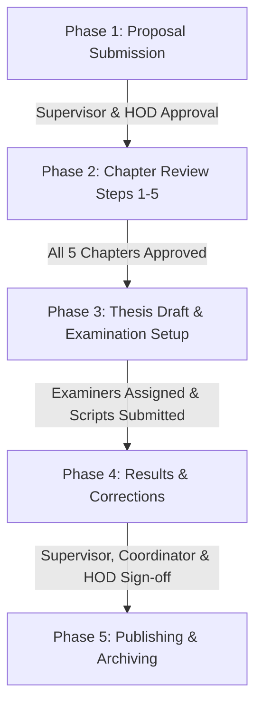

# GIMPA Thesis Repository System — Complete Technical & User Documentation

## 1. Executive Summary

The **GIMPA Thesis Repository System** is an end-to-end web platform engineered for the **Ghana Institute of Management and Public Administration (GIMPA)** to manage, monitor, evaluate, and archive undergraduate and postgraduate thesis/dissertation research workflows.

The system replaces manual, paper-based submission processes with a structured 5-phase workflow, enabling seamless collaboration between **Students**, **Supervisors**, **Heads of Departments (HODs)**, **Deans**, **Coordinators**, and **Library Administrators**.

---

## 2. Technology Stack

### Backend Architecture
* **Framework**: [FastAPI](https://fastapi.tiangolo.com/) (Python 3.12+)
* **Database**: SQLite (SQLAlchemy 2.0 ORM with Async capabilities)
* **Authentication**: OAuth2 with Password Hashing (`passlib[bcrypt]`) & JSON Web Tokens (JWT)
* **Schema Validation**: Pydantic v2
* **File Operations**: `python-docx` for document manipulation, PyPDF2 for PDF metadata & text extraction
* **Email Engine**: Built-in SMTP notification service (`_send_thesis_email`)

### Frontend Architecture
* **Framework**: React 19 + [React Router v7](https://reactrouter.com/)
* **Build System**: [Vite](https://vitejs.dev/)
* **Styling**: Vanilla CSS / Tailwind CSS v4 design system with custom HSL variables and Shadcn UI component primitives
* **Iconography**: Lucide React (`lucide-react`)
* **Document Preview & Editor**: `@onlyoffice/document-editor-react` and custom DOCX/PDF preview components

---

## 3. User Roles & Access Control Matrix

The system implements strict Role-Based Access Control (RBAC):

| Role | Key Capabilities |
| :--- | :--- |
| **Student** | Submit thesis proposals; upload & resubmit chapter step drafts (Steps 1–5); view supervisor feedback; upload final combined thesis & examination corrections; update progress checklists. |
| **Supervisor** | Approve/reject proposals; review and score chapter steps; leave line-by-line feedback; assign/approve post-examination corrections; track assigned students. |
| **Department HOD** | Review and approve department proposals; assign/manage department supervisors; give final departmental sign-off on completed theses. |
| **Dean** | View high-level department analytics, pipeline metrics, and supervisor workload across faculties. |
| **Coordinator / Admin** | Assign internal and external examiners; upload examiner mark sheets/scripts; manage user accounts (individual & bulk CSV/Excel import); oversee phase transitions and system audit logs. |
| **Library / Public User** | Search and browse published theses; download archived papers; view citation metrics and department statistics. |

---

## 4. Multi-Phase Thesis Workflow Engine

The platform guides every research project through 5 sequential phases:



### Phase 1: Proposal Submission & Approval
1. Student submits topic title, abstract, department selection, and proposed supervisor.
2. Assigned Supervisor reviews proposal (Approved / Revise).
3. Department HOD provides final proposal sign-off.

### Phase 2: Chapter Review (Steps 1 to 5)
* **Step 1**: Chapter 1 — Introduction & Background
* **Step 2**: Chapter 2 — Literature Review
* **Step 3**: Chapter 3 — Methodology
* **Step 4**: Chapter 4 — Data Analysis & Results
* **Step 5**: Chapter 5 — Discussion, Conclusion & Recommendations

*For each step:*
* Student uploads file (DOCX/PDF).
* Supervisor reviews online via document viewer/ONLYOFFICE or downloads file.
* Supervisor issues decision (**Approved** or **Revise**) with comments.
* If revision requested, student resubmits via the **"Submit Edited Step File"** action (preserves existing step record).

### Phase 3: Thesis Draft & Examination Setup
1. Once all 5 steps are approved, student compiles and uploads the full combined thesis draft.
2. Coordinator assigns **Internal Examiner** and **External Examiner**.
3. Coordinator uploads returned examiner scripts and mark sheets.

### Phase 4: Examination Results & Corrections
1. Student views examiner feedback and uploads revised corrections script.
2. Tri-level approval chain required:
   * **Supervisor Approval**
   * **Coordinator Approval**
   * **HOD Final Approval**

### Phase 5: Publishing & Archiving
1. Approved thesis is marked as `published`.
2. Automatically cataloged into the GIMPA Thesis Public Repository with searchable tags, metadata, and citation tracking.

---

## 5. API Endpoints Reference

### Authentication (`/api/v1/auth`)
* `POST /login` — User login & JWT issuance
* `POST /refresh` — Refresh access token
* `GET /me` — Fetch current user profile

### Thesis & Workflow (`/api/v1/theses`)
* `POST /theses/submit-proposal` — Create new thesis proposal
* `POST /theses/{id}/submit-step` — Upload new chapter step
* `POST /theses/steps/{step_id}/resubmit` — Resubmit updated step draft
* `POST /steps/{step_id}/decision` — Submit supervisor decision (approved/revise)
* `POST /theses/{id}/finish-steps` — Complete Phase 2 and advance to draft stage
* `GET /theses/steps/{step_id}/file` — Download step document file

### Account & User Management (`/api/v1/users`)
* `GET /users` — List system users with role filters
* `POST /users/import` — Bulk import user accounts from CSV/Excel
* `PUT /users/{id}/password` — Password reset/update

---

## 6. Setup & Installation Guide

### Prerequisites
* Python 3.12 or higher
* Node.js v18+ & npm

### Backend Setup
```bash
cd backend
python -m venv venv
# On Windows:
.\venv\Scripts\activate
# On Linux/macOS:
source venv/bin/activate

pip install -r requirements.txt
uvicorn app.main:app --reload --host 127.0.0.1 --port 8011
```

### Frontend Setup
```bash
cd frontend
npm install
npm run dev
```

The frontend will run on `http://localhost:5173` (or next available port) and connect to the backend API at `http://localhost:8011`.

---

## 7. Repository Link

* **GitHub Repository**: [https://github.com/Lexies99/GIMPA_Thesis_Repository.git](https://github.com/Lexies99/GIMPA_Thesis_Repository.git)
